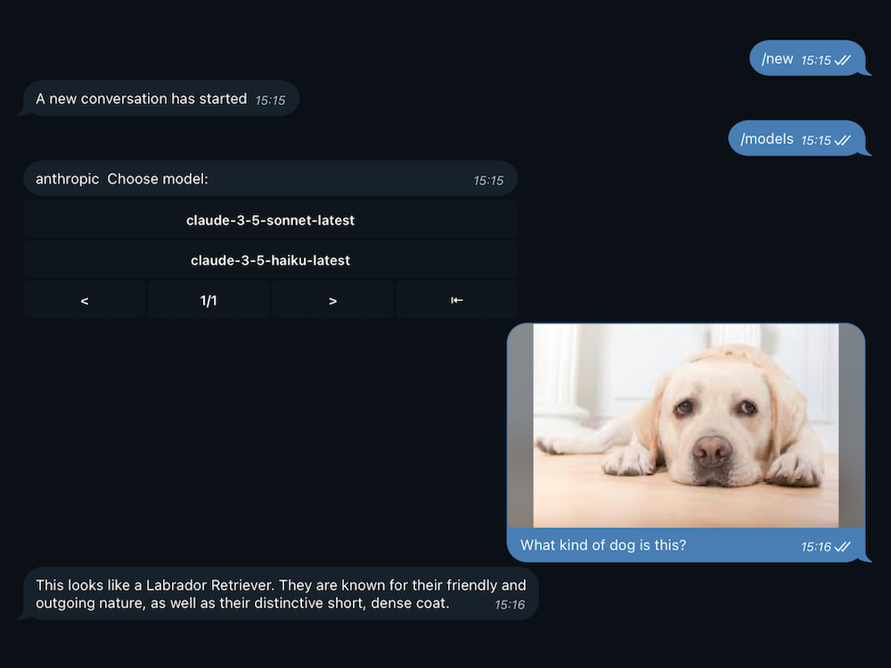

<h1 align="center">
ChatGPT-Telegram-Workers
</h1>

      <a href="README.md">English</a> | 中文

    <em>轻松在Cloudflare Workers上部署您自己的Telegram ChatGPT机器人。</em>

    

## 关于

最简单快捷部署属于自己的ChatGPT Telegram机器人的方法。使用Cloudflare Workers，单文件，直接复制粘贴一把梭，无需任何依赖，无需配置本地开发环境，不用域名，免服务器。 可以自定义系统初始化信息，让你调试好的性格永远不消失。

查看Demo

## 特性

- 无服务器部署
- 多平台部署支持(Cloudflare Workers, Vercel, Docker[...](doc/cn/DEPLOY_OTHERS.md))
- 适配多种AI服务商(OpenAI, Cloudflare AI, Cohere, Anthropic, Mistral...)
- Web 管理后台(Telegram Mini App)管理 AI 提供商与各项设置
- 自定义指令(可以实现快速切换模型,切换机器人预设)
- 基于 KV 的简洁配置
- 流式输出
- 多语言支持
- 文字生成图片
- [插件系统](doc/cn/PLUGINS.md),可以自定义插件

## 文档

- [一键部署](https://deploy.workers.cloudflare.com/?url=https://github.com/TBXark/ChatGPT-Telegram-Workers) —— Cloudflare 会克隆仓库、创建 KV namespace、询问 Bot Token 并完成部署。
- [部署Cloudflare Workers](./doc/cn/DEPLOY.md)
- [部署Vercel、本地、Docker](./doc/cn/DEPLOY_OTHERS.md)
- [配置参数和指令](./doc/cn/CONFIG.md)
- [插件系统](./doc/cn/PLUGINS.md)
- [v1 迁移到 v2 指南](./doc/cn/MIGRATION.md)
- [变更日志](./doc/cn/CHANGELOG.md)

## 关联项目

- [telegram-bot-api-types](https://github.com/TBXark/telegram-bot-api-types) 编译后0输出的Telegram Bot API SDK, 文档齐全,支持所有API

## 贡献者

这个项目存在是因为所有贡献的人。[贡献](https://github.com/tbxark/ChatGPT-Telegram-Workers/graphs/contributors)。

## 许可证

**ChatGPT-Telegram-Workers** 以 MIT 许可证发布。[详见 LICENSE](LICENSE) 获取详情。
